# Computer Graphics 기말 과제_강동욱 리포트

> 컴퓨터그래픽스 최종 과제 · **Three.js (WebGL2)** 기반 1인칭 방탈출 공포 게임  
> 핵심 GI 기술: **DDGI (Dynamic Diffuse Global Illumination)** 직접 구현  
> 레퍼런스: 바이오하자드 7 (Baker 가족 식사 씬)
>
> 🔗 **플레이 링크:** https://dwhaha6.github.io/Computer-Graphics-horror-game/  
> 더 쾌적한 환경에서의 play를 위해 가능하면 Edge에서 접속하시는걸 권장드립니다.(chrome에서도 play에 문제는 없지만 조금씩 끊길 수 있습니다)

## 주의사항
- 가능한 레포트에는 무서운 사진을 제외하려고 하였으나 공포게임 특성상 사진첨부가 불가피한 경우가 있었습니다. 양해해주시면 감사하겠습니다.

## 조작법
| 키 | 동작 |
|---|---|
| WASD / 마우스 | 이동 / 시선 |
| E | 상호작용(줍기·열기·대화·먹기) |
| F | 보조 상호작용(수갑·숨기·소리치기·사다리 오르기) |
| C | 웅크리기(쇠창살 대화·의자 밑) |
| I | 인벤토리 |

## 0. 목차
#### 1. 게임 개요
#### 2. 기획 
#### 3. 완성도 
#### 4. GI 기술 — DDGI 
#### 5. 시스템 구현 / 아키텍처
#### 6. 에셋 파이프라인
#### 7. 개발 과정에서의 문제와 해결
#### 8. 빌드 · 실행 · 배포
#### 9. 퍼즐 해설 (공략)

---

## 1. 게임 개요

| 항목 | 내용 |
|---|---|
| 장르 | 1인칭 방탈출 공포 |
| 핵심 GI | **DDGI** (프로브 기반 동적 확산 전역조명) — 직접 구현 |
| 플랫폼 | 웹 (Three.js / WebGL2), 데스크탑 브라우저 |
| 조작 | WASD 이동 · 마우스 시선 · E 상호작용 · F 보조행동 · C 웅크리기 · I 인벤토리 |
| 분량 | 단일 방 + 인접 옆방(쇠창살), 퍼즐 체인 + 납치범 복귀 루프 + 멀티 엔딩 3종 |

**한 줄 소개:**
> 영문을 모른 채 갇힌 주인공이 각종 퍼즐을 풀며 방을 탈출하고자 하는 공포 게임

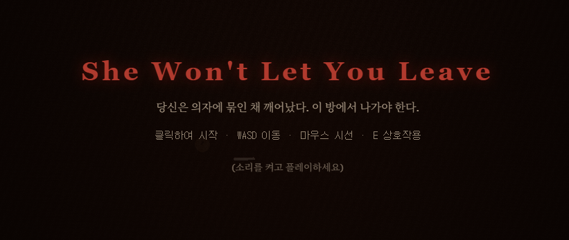

---

## 2. 기획

### 2.1 컨셉 · 레퍼런스
> 바이오하자드 공포게임에서 영감을 받아 제작, 기존 공포 방탈출과 다른 점은 납치범이 오는 소리가 들리면 풀던 퍼즐을 멈추고 재빨리 원래의 방상태로 되돌려놔야 한다는 점에 있음

#### 방 전경 이미지
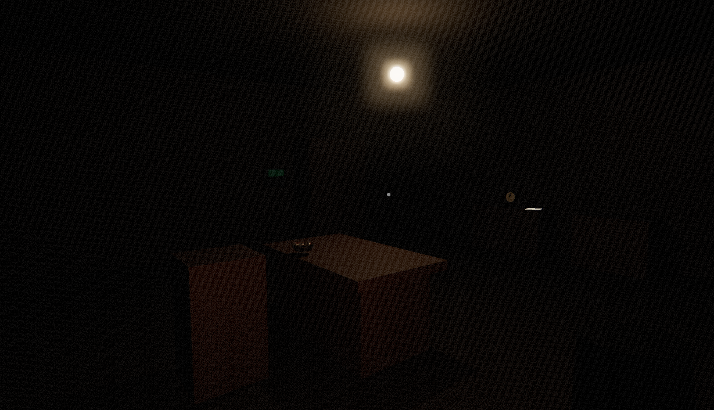

### 2.2 게임의 진행 구조 — 5개의 섹션

- 이 게임은 **퍼즐을 하나씩 풀어 나가는 구조**이며, 진행도를 **5개의 섹션(section)** 으로 나누어 제작하였음.  
- 각 섹션은 *"아직 그 단계의 퍼즐을 풀지 못한 구간"* 을 뜻하고, 퍼즐을 하나 풀면 다음 섹션으로 넘어감.  
- 섹션이 바뀔 때마다 새로운 도구와 목표가 열리며, 옆방에 갇힌 동료(김씨)의 대사도 그 상황에 맞게 달라짐.

| 섹션 | 구분 (이것을 풀기 전까지) | 이 구간에서 플레이어가 하는 일 |
|---|---|---|
| **1. 결박** | **수갑**을 풀기 전 | 의자에 묶인 채 깨어나, 식탁의 **숟가락**을 주워 수갑을 풀고 비로소 자유롭게 움직인다 |
| **2. 시계** | **시계 퍼즐**을 풀기 전 | 자명종 시계를 돌려 **분침(=열쇠)** 을 얻고, 잠긴 **장롱**을 열어 단서 **쪽지**를 줍는다 |
| **3. 서랍** | **서랍 비밀번호**를 풀기 전 | 쪽지의 단서를 해독해 **서랍 네 자리** 를 풀고 **사진 2장**을 얻는다 |
| **4. 그림 암호** | **그림 암호**를 풀기 전 | 사진 두 장에 숨은 규칙으로 **네 글자 영단어** → 벽 암호장치 → **사다리**를 얻는다 |
| **5. 탈출** | **탈출**하기 전 (마지막 구간) | 옆방 김씨와 거래해 **드라이버**를 얻고, 천장 **환풍구**로 탈출한다 (선택에 따라 결말이 갈림 → 2.5에서 자세히) |

> 앞 퍼즐에서 얻은 보상이 다음 퍼즐을 푸는 데 쓰이는 식으로 이어짐  
> (숟가락→자유, 분침→장롱, 쪽지→서랍, 사진→사다리, 사다리+드라이버→탈출)
>
> ※ 특정 트리거가 발동될 때마다 납치범이 돌아오는데 이는 2.3에서 자세히 설명해두었습니다.

**▸ 섹션 2 (시계) 예시 — 분침 획득 이미지**
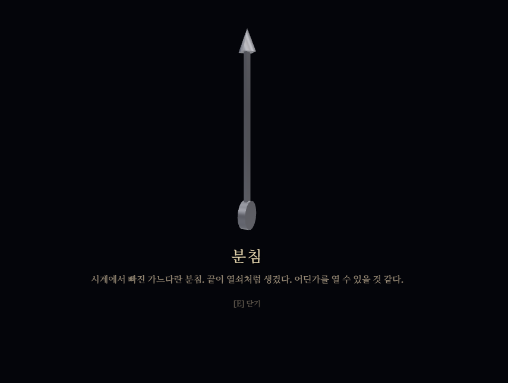

**▸ 섹션 3 (서랍) 예시 — 네 자리 숫자 자물쇠**
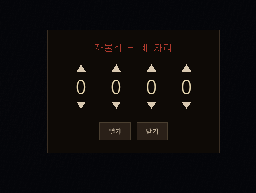

**▸ 섹션 4 (그림 암호) 예시 — 영문 네 자리 암호**
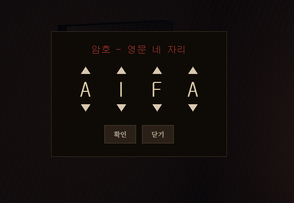

### 2.3 납치범(할머니) 메커니즘
- **트리거**: 자명종 오답시 · 장롱 최초 개방시 · 영단어 문제 정답시 · 소리를 지를시(특수 상호작용 뒤에서 자세히) · 환풍구 탈출 시도시
- **할머니가 방에 들어와 점검하는 것**(흔적 복원): 장롱 닫힘 · 손전등 제자리 · 서랍 닫힘 · 사다리 회수 · 의자 착석 · 수갑 잠김
- **행동 분기**: 들어와 두리번 → (이상 없음) 방을 둘러보고 **그냥 나감** / (이상 있음·은신) **코앞까지 다가와 점프스케어**
- **은신**: 장롱 안에 숨기(F) -> 특정 item이 없다면 죽는 것 확정

**▸ 카운트다운 타이머 — 트리거 발동 후 할머니가 오기까지의 제한 시간**
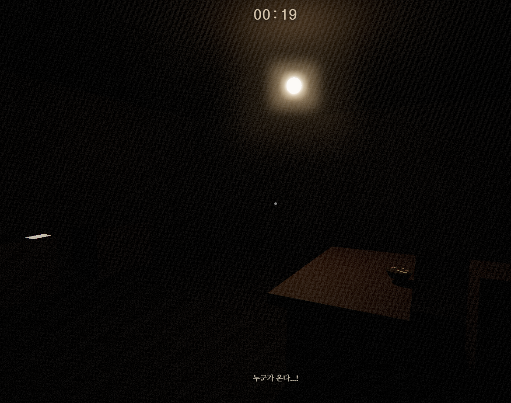

**▸ 납치범 입장 — 문 앞에 선 채 방을 살피는 할머니**
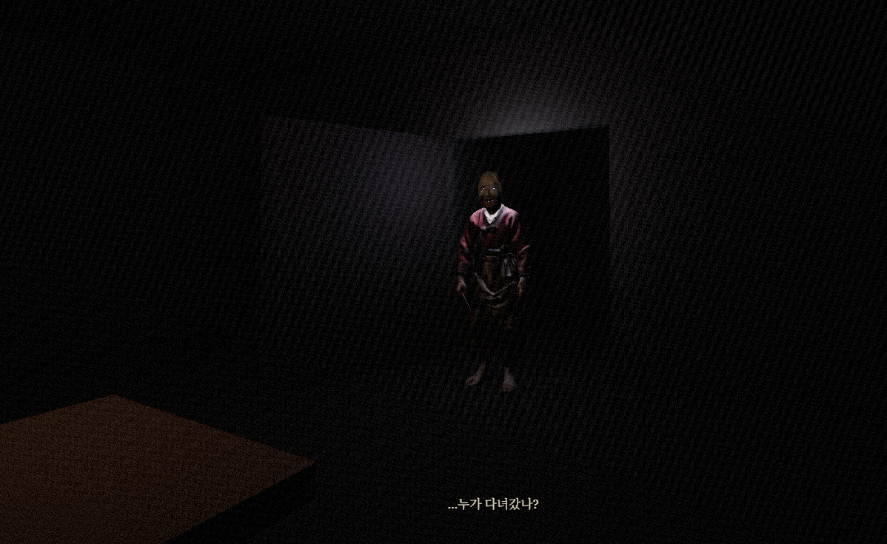

### 2.4 긴장 유발 장치
- 서랍 개방 시 바퀴벌레 사운드 · 게임중 랜덤으로 벽 긁힘/삐걱 사운드
- 쇠창살 위 **아기 사진**(그쪽을 보면 비명) · 어두운 공포 분위기를 "필름 질감"으로 강화(3.2에서 자세히)


**▸ 아기 사진 — 시야에 들어오면 비명이 들린다**
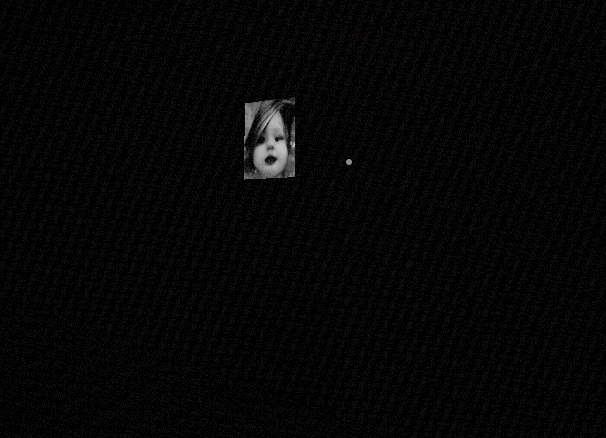


### 2.5 멀티 엔딩 (3종) + 분기 설계
| 엔딩 | 조건 | 결말 |
|---|---|---|
| **Hidden** | 의자 밑 **칼** 선택 → 소리쳐 부르고 장롱에서 급습 | 할머니를 살해(hidden ending 사진에서 반전 결말) |
| **Normal** | 옆방에 **분침(가짜 열쇠)** 건넴 → 환풍구 탈출 | 혼자 탈출하나 할머니가 따라옴 |
| **True** | 의자 밑 **열쇠** → 옆방에 건넴 → 함께 탈출 | 둘 다 생존·자수 |
- **히든 분기 진입 조건**: 사다리 획득 **이후** 벌레 스프 섭취 + 어두운 방 → 벽에 푸른 글씨(의/자/밑) → 의자 밑에서 칼/열쇠(히든 item) 택1 가능

**▸ Hidden item 선택지 사진 — 의자 밑 칼/열쇠 택1**
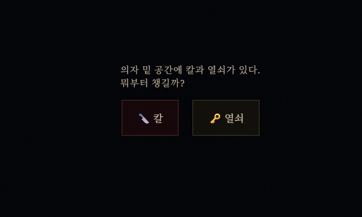
#### 각 엔딩 해석
> **Normal ending**: 주인공에게 가짜 열쇠를 건네받은 옆방 김씨는 탈출을 시도하다 죽게되고 주인공은 그 틈을 타 환풍구로 탈출을 시도한다, 그러나 환풍구로 따라온 할머니에 의해 결국 살해당하고 만다.  
> **True ending**: Hidden item 열쇠를 얻은 주인공은 김씨에게 진짜 열쇠를 넘기고 본인은 환풍구로 도주한다, 두 사람 모두 탈출에 성공했으나 어째서인지 경찰서로 가 "자수"를 하게된다.  
> **Hidden ending**: 김씨의 열쇠를 포기하고 또다른 Hidden item인 칼을 얻은 주인공은 할머니를 살해하고자 장롱에 숨는다, 결국 할머니를 살해한 주인공은 알고보니 할머니의 가족을 살해한 살인범이였음이 드러나며 게임은 끝이 난다.

#### 각 엔딩 결과 화면 (게임 내 캡쳐)

| Hidden Ending | Normal Ending  | True Ending|
|:---:|:---:|:---:|
| 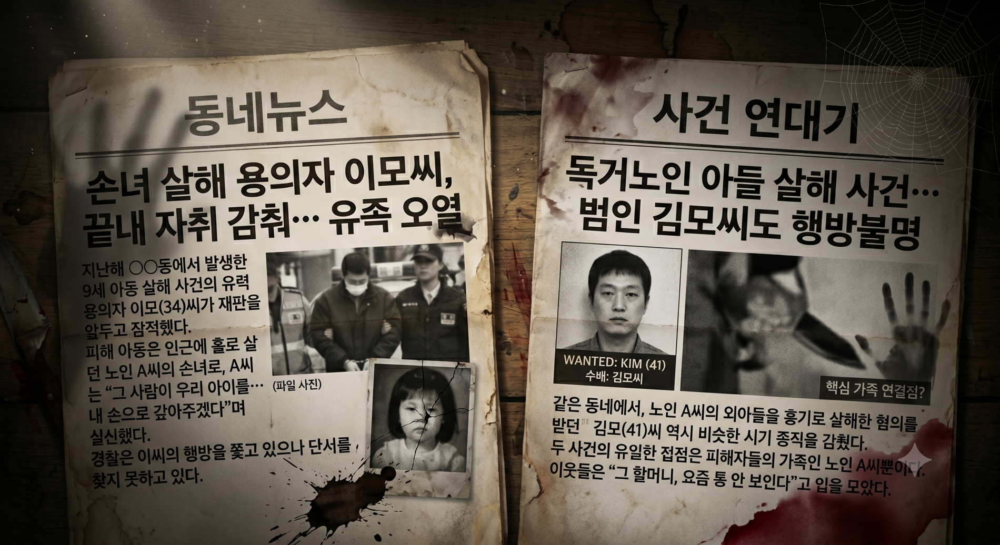 | 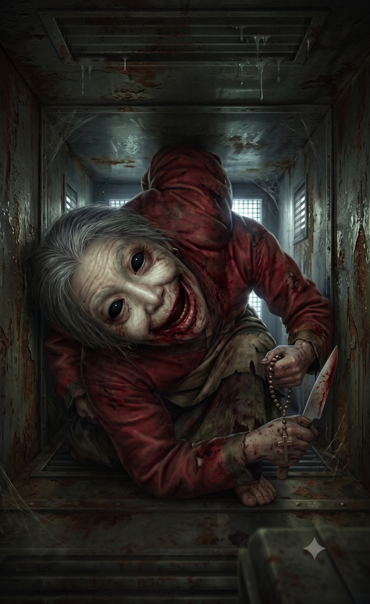 | 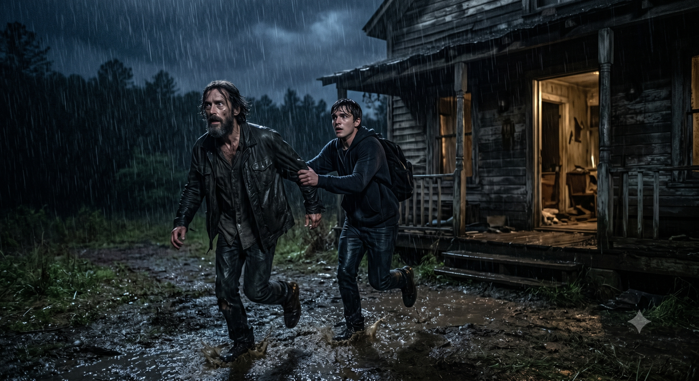 |
| 칼 선택 → 할머니 살해<br>(주인공이 사실 살인범) | 분침(가짜 열쇠) → 환풍구 탈출<br>(할머니가 따라와 살해) | 열쇠 → 함께 탈출<br>(둘 다 생존·자수) |


### 2.6 죽음 · 세이브포인트 설계
- **1번째 죽음**: 리셋 X → 구간 체크포인트로 부활(아이템·진행 유지, 위험 트리거 초기화)
- **2번째 죽음**: 더 끔찍한 이미지(death twice) → 완전 리셋
> 난이도 조절을 위한 요소이지만 죽음에 대한 penalty는 있어야 하니 2번째 죽음의 점프 스케어 이미지를 더 무섭게 바꾸었습니다.

---

## 3. 완성도 

### 3.1 구현 기능 체크리스트
- [v] 1인칭 이동/시선/충돌, 웅크리기, 인벤토리·아이템 인스펙트(3D 회전)
- [v] 퍼즐 체인(숟가락·시계·장롱·서랍·그림·암호)
- [v] 납치범 3D 캐릭터(접근/점검/추격/점프스케어/은신급습) + 가구 충돌 회피
- [v] 멀티 엔딩 3종 + 죽음/세이브포인트
- [v] section별로 달라지는 상호작용 효과 + 음원 사운드(배경음악·발소리·비명·빗소리·엔딩음·칼 등)
- [v] **DDGI 전역조명** (4장 참조)

#### 인벤토리 예시 이미지

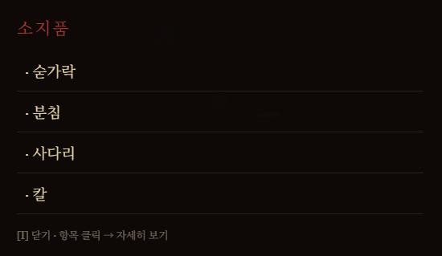

### 3.2 사운드 · 연출

**■ 사운드** : OpenGameArt.org 사이트에서 무료로 다운로드(horror, scream, scare 등의 검색)  

#### 오디오 사운드 검색 예시
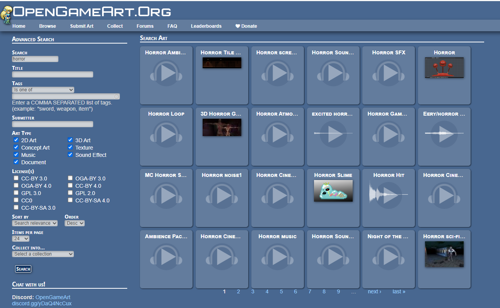

**■ 연출 — 화면 후처리(포스트프로세싱)**

3D 장면을 다 그린 뒤, **그 화면 위에 "필터"를 한 겹 씌우는 단계**(사진 앱 필터·인스타 보정 같은 개념). Three.js의 `EffectComposer`로 여러 필터를 차례대로 통과시킨다.

```
3D 화면 → ① 밝은 곳 번지기(Bloom) → ② 공포 필터(가장자리 어둡게 + 색 빼기 + 색 살짝 어긋남 + 거친 노이즈) → ③ 출력
```

이 중 화면 전체에 깔리는 **자잘한 지글거림**이 바로 **필름 그레인(film grain)**. **매 프레임 화면에 아주 작은 무작위 밝기 점들을 흩뿌리는** 효과로, 오래된 필름이나 낡은 비디오테이프처럼 보이게 해 공포 분위기를 살림. (코드: `src/post/Post.js`)

요약하자면 "각 픽셀에 작은 무작위 노이즈 값을 더하는 것"

```glsl
float n = hash(...);        // 픽셀마다 다른 무작위 값 (0~1)
col += (n - 0.5) * 0.03;    // 그만큼 색을 아주 살짝 밝게/어둡게
```

> 이 노이즈가 점이 아니라 **사선 무늬**처럼 보이는 건 계산식의 특성(모아레 현상) 때문인데, 오히려 거친 필름 느낌이 살아서 그대로 뒀음.

- DDGI 간접 조명 효과와 섞여 게임 전체의 음산한 분위기를 완성

#### Film grain 예시
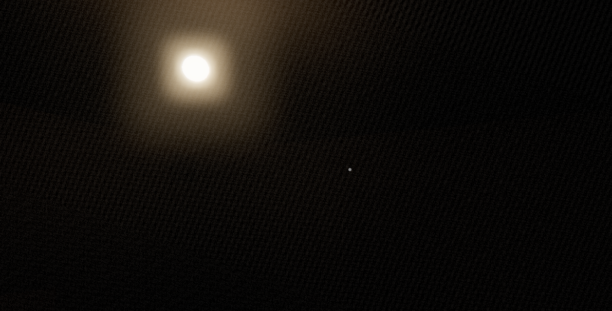

### 3.3 사용성 / 가독성
> 1. 편리한 진행을 위해 영어 자물쇠의 경우 각 글자 범위를 13글자로 축소
> 2. 옆방 남자와의 대화를 통해 초반 퀴즈 힌트를 얻을 수 있음
> 3. 초반 납치범의 복귀속도를 느리게(40초) 세팅
> 4. 수갑 착용시 남은 복귀 시간을 기다리지 않고 즉시 할머니 복귀(편리함과 더불어 곧바로 들어오는 공포감도 같이 유발)

#### 퀴즈에 대한 약간의 hint 예시
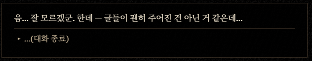

---

## 4. GI 기술 — DDGI

### 4.1 DDGI 개념 요약
- 강의 때 배운 개념과 같으나 간단히 요약하자면 3d Grid 공간에 프로브를 배치, 격자에 방향별 irradiance 저장(SH구조) → progressive하게 확산 GI 
#### 왜 이 게임에 적합한가?
- 현재 게임에선 갇힌 방 안에서 모든 진행이 이루어짐 정규 격자로 probe를 배치해도 빈공간에서 낭비되는 probe 없이 효율적인 illumination이 가능하다고 판단

#### Probe 가시화한 이미지
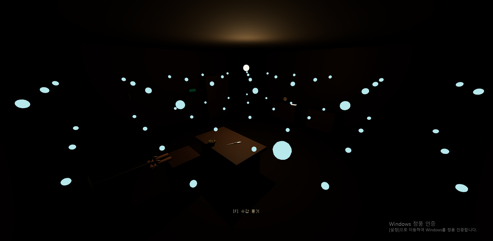

### 4.2 파이프라인

| 단계 | 설명 |
|---|---|
| **① Probe 배치** | 방 공간에 일정 간격으로 Probe를 **격자로** 배치. (위 가시화 이미지) -> 10×4×8 = 320개 |
| **② 빛 모으기** | 강의에서 배운대로 광선을 N개 쏘는 것 대신 (WebGL2엔 하드웨어 레이트레이싱이 없음) 프로브 위치에서 주변 장면을 360°(큐브맵 6면)로 한 번에 렌더해서, 각 방향에 뭐가 있고 얼마나 밝은지를 통째로 담음 |
| **③ 압축 저장 (옥타헤드럴)** | 모은 "방향별 빛"을 작은 타일 한 장으로 압축. **구(전방향)를 평면 지도처럼 펼치는** 방식이라 옥타헤드럴이라 부름. 모든 프로브 타일은 큰 텍스처 한 장(아틀라스)에 모아 둠. |
| **④ 표면에 입히기** | 실제 벽·바닥·물체를 그릴 때, 그 표면 주변의 **가까운 프로브 값들을 꺼내 섞어** 간접광으로 칠함. |
| **⑤ 빛샘 막기 (Chebyshev)** | 벽 너머 프로브의 빛이 벽을 뚫고 새는 걸 막음. 프로브가 함께 저장해 둔 **거리 정보**로 "이 표면이 그 프로브에서 실제로 보이나?"를 판단해, 안 보이면 그 빛을 쓰지 않음. |
| **⑥ 조금씩 갱신 (분할 갱신)** | 매 프레임 모든 프로브를 다시 계산하면 무거우니 강의 때 배운대로 Progressive하게 갱신.|


### 4.3 Probe가 게임 분위기에 어떻게 기여했는가? 
> 할머니가 등장하면 그녀를 따라다니는 전용 조명이 존재 -> 할머니가 움직이면 3d 공간상에 grid 배치한 probe가 갱신되며 간접광 효과가 반영됨  

>즉 단순히 캄캄한 방에서 빛 하나만 돌아다니는 것보다 더 무섭고 음산한 분위기 연출 가능 

#### 전용 조명 예시 이미지
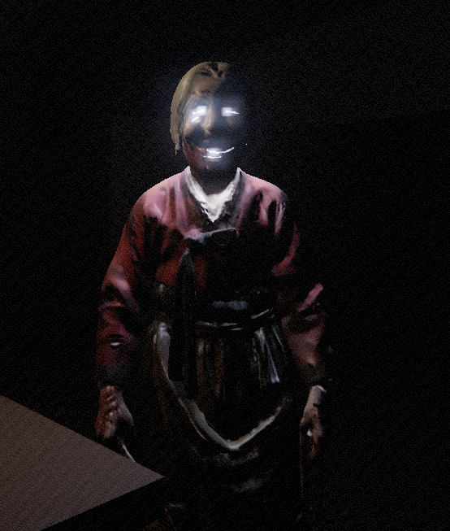

>휴대용 랜턴을 통한 간접광 효과로 어두운 방 안의 공포 분위기가 더 살아남 + 3.2의 노이즈 블러 효과

---

## 5. 시스템 구현 / 아키텍처

### 5.1 기술 스택 · 폴더 구조
| 영역 | 모듈(파일) | 역할 |
|---|---|---|
| 진입/오케스트레이션 | `src/main.js` | 씬·퍼즐·엔딩·죽음·tick 루프 |
| GI | `src/gi/ddgi/*` | DDGI 프로브 볼륨·갱신 |
| 플레이어 | `src/player/PlayerController.js` | 이동·충돌·웅크리기 |
| 월드 | `src/world/*` | Room, Captor, Wardrobe, Drawer, Clock, Bars, CodeLock, Lantern, Food, items |
| UI | `src/ui/*` | Inventory, InspectView |
| 코어 | `src/core/*` | Input, AudioManager |
| 포스트 | `src/post/Post.js` | 톤매핑·포그·공포 포스트 |

### 5.2 상태 관리
진행 상태는 `src/main.js`의 전역 플래그로 들고 있음. tick 루프랑 상호작용 콜백이 이걸 읽고 바꿈.
- **진행도 `gameSection`(1~5)**: 현재 어느 단계인지 보관. 옆방 김씨의 대사 분기와 히든 단서 발현 조건을 결정.
- **납치범 상태머신**: `captor.trigger(초)`로 카운트다운 시작 → `DORMANT → COUNTDOWN → 입장 → 점검 → 퇴장/추격` 상태가 시간에 따라 전이 (`src/world/Captor.js`).
- **죽음/세이브포인트**: `deaths` 카운터로 1번째(체크포인트 부활)·2번째(death twice 후 리셋)를 구분. `paused`로 ESC 일시정지.
- **엔딩 분기**: `escapeMode`(solo/together)·`soloLocked`·칼/열쇠 보유 플래그의 조합으로 Hidden/Normal/True 세 결말이 갈린다.

---

## 6. 에셋 파이프라인
- **3D 캐릭터(할머니)**: gemini로 생성한 2d 이미지 → 3D 변환(TRIPO, 무료) → GLB로 추출
- **이미지**: 원하는 이미지는 gemini를 통해 주로 생성
#### 이미지 생성 프롬프트 예시
```
"손녀 살해 용의자 이모씨, 끝내 자취 감춰… 유족 오열"

지난해 ○○동에서 발생한 9세 아동 살해 사건의 유력 용의자 이모(34)씨가 재판을 앞두고 잠적했다. 피해 아동은 인근에 홀로 살던 노인 A씨의 손녀로, A씨는 실신했다. 경찰은 이씨의 행방을 쫓고 있으나 단서를 찾지 못하고 있다.

"독거노인 아들 살해 사건… 범인 김모씨도 행방불명"

같은 동네에서, 노인 A씨의 외아들을 흉기로 살해한 혐의를 받던 김모(41)씨 역시 비슷한 시기 종적을 감췄다. 두 사건의 유일한 접점은 피해자들의 가족인 노인 A씨뿐이다. 이웃들은 "그 할머니, 요즘 통 안 보인다"고 입을 모았다.

혹시 이 내용을 담은 2개의 뉴스기사 사진을 섬뜩하고 공포스럽게 이미지로 만들어줄 수 있나 (이모씨, 김모씨 둘다 남자임) 이렇게 해서 다시 이미지 줘봐  
```

#### 사이트에서 캐릭터 제작 예시


#### 참고

- 방·가구: 외부 에셋 없이 Three.js 기본 지오메트리(박스·실린더 등)로 코드에서 직접 모델링

---

## 7. 주요 문제와 해결 (개발 로그)

### 문제1. 할머니가 책상을 통과하는 문제
- 축별 슬라이드 충돌 회피(가구에 막히면 그 축은 멈추고 다른 축으로 미끄러져 돌아감)로 문제 해결

### 문제2. 할머니에게 고정되어야 하는 시선이 다른 벽 방향으로 고정됨
- 할머니가 들어올 경우 주인공의 시선은 할머니에게 고정되어야 함 BUT 할머니가 아닌 반대편으로 시선이 고정됐었음(아래 내용이 원인)

#### 버그 화면 — 할머니가 왔으나 시선이 벽으로 돌아가 아무것도 안 보임
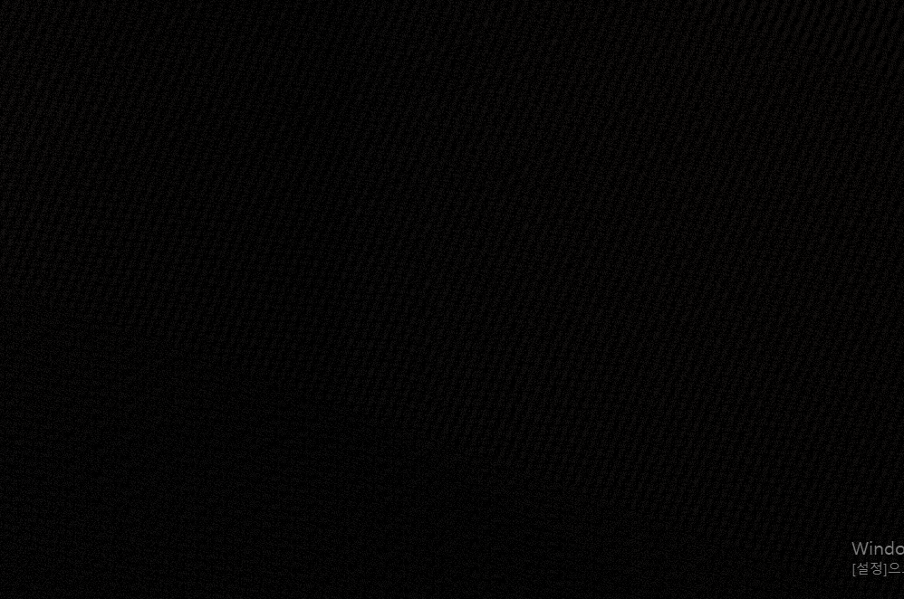

- 일반 Object3D: 로컬 +Z가 앞
- 카메라: 로컬 −Z가 앞 (카메라는 −Z 방향을 바라봄)  
→ 카메라에게 "저 사람이 보는 방향 똑같이 봐"라고 시켰는데 카메라와 그 사람의 앞뒤 컨벤션이 반대라면 카메라는 정반대를 보게 되는 것!

- 더미를 그냥 객체가 아니라 PerspectiveCamera로 만들어서 해결, 즉 더미도 카메라이기에 둘의 컨벤션을 통일시켜줌으로써 해결

- (new THREE.Object3D() -> new THREE.PerspectiveCamera())

### 문제3. 엔딩 이미지에서 클릭을 해야 이미지가 사라지며 다음으로 넘어가야 하는데 0.1초만에 바로 넘어가는 버그(Click bubbling)
- 독백 대화를 넘긴 후 엔딩 이미지가 떠야 하는데 뜨지 않고 넘어 갔음
- 엔딩 이미지를 띄우는 그 클릭이 부모로 전파(버블링)되어 reload 핸들러를 즉시 실행 -> 이미지가 바로 사라짐
- reload 핸들러를 부모 오버레이가 아니라 버튼 자기 자신에 달아서 해결
```
// 잘못: 부모에 핸들러 → 같은 클릭이 버블링돼 즉시 reload
o.onclick = () => location.reload();   // ✗

// 고침: 버튼 자신에 → 다음 클릭에만 reload
btn.onclick = () => location.reload(); // ✓
```
### 문제4. 철창에서 대화 시도시 게임이 완전히 멈춰버림
- 게임 프레임은 매 프레임 끝에서 스스로 다음 프레임을 예약(rAF)하는 식으로 루프를 돔
- 그런데 DIALOGUE_SECTIONS에서 읽어올 대화가 없자 다음 프레임을 불러오기도 전에 에러가 터짐
- 결국 화면 갱신도 안 되고 입력 처리도 안 되는 먹통 현상 발생
#### 해결
- tick try/catch(안전망): 루프 본문 전체를 try/catch로 감쌈 → 어떤 에러가 나도 잡아서 로그만 남기고, requestAnimationFrame(tick)은 무조건 실행 → 한 프레임이 깨져도 루프가 안 죽고 계속 돎.
```
function tick() {
  try { …한 프레임 처리… } catch(e) { console.error(e); }  // 에러 나도
  requestAnimationFrame(tick);                              // 다음 프레임은 무조건 예약
}
```
- 한 프레임이 깨져도 루프가 안 죽고 계속 돎 -> 예상치 못 한 에러에 보다 robust한 구조

#### 게임이 멈춰버린 예시 이미지
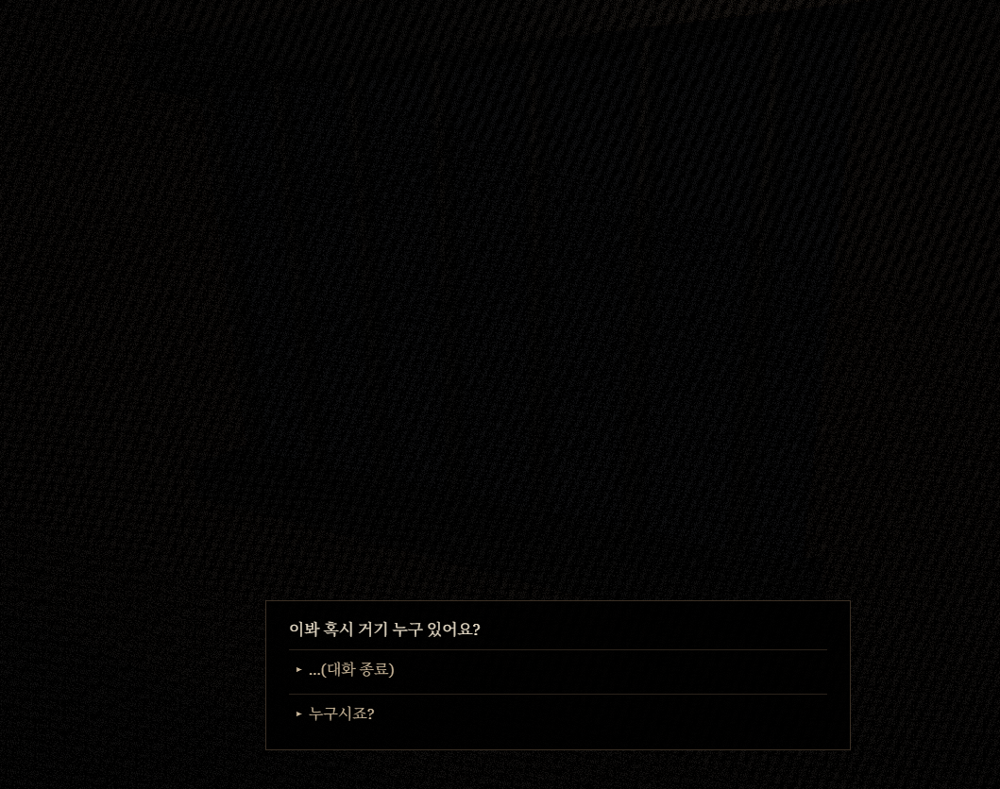


---

## 8. 빌드 · 실행 · 배포
```bash
npm install
npm run dev      # 로컬 개발 (http://localhost:5173)
npm run build    # 프로덕션 빌드 → dist/
npm run deploy   # GitHub Pages 배포 (gh-pages)
```
- 가능하면 Chrome보단 Edge를 권장
---

## 9. 퍼즐 해설 (공략)

### 9.1 시계 문제
- 강의 때 배운 개념을 퀴즈에 쉽게 녹여보았음, RHS에서 z축 기준 90도 회전은 반시계 방향이니 시계를 반시계 방향으로 돌리면 됨


### 9.2 서랍 문제
숫자가 a-b라고 하면 a는 몇번째 줄 문장인지 b는 그 문장의 몇번째 단어인지를 뜻함 따라서 답은 9219

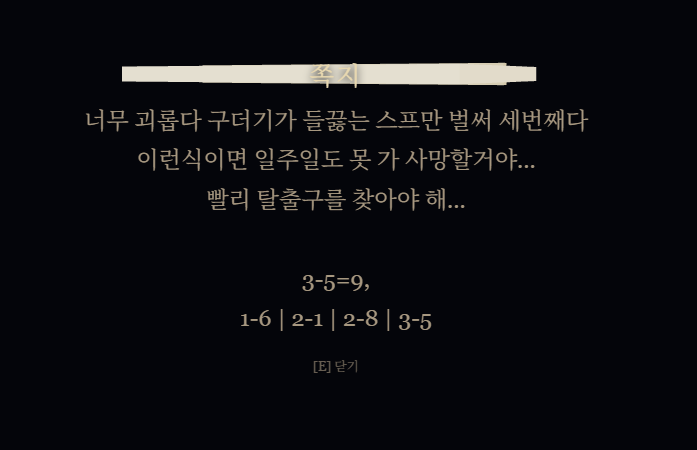

### 9.3 사다리 문제 (정답 GOLD)
버튼의 색깔이 핵심 -> 해당되는 색을 영어로 풀면 답이 보일 것

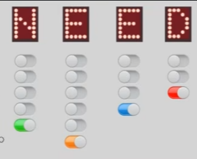

### 9.4 Hidden item 트리거
**사다리 획득 후**, 랜턴을 **끈(어두운) 상태**에서 **벌레 스프**를 먹으면 벽에 푸른 글씨 "의 / 자 / 밑" 이 떠오름 → **의자 밑**에서 칼/열쇠 택1(Hidden 분기 진입).

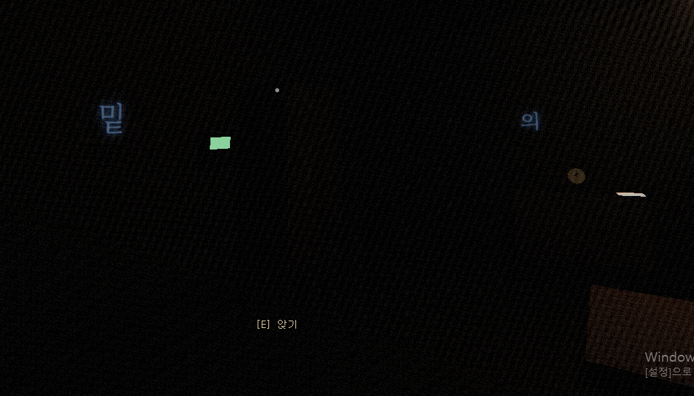

---

### 부록 엔딩 분기 다이어그램

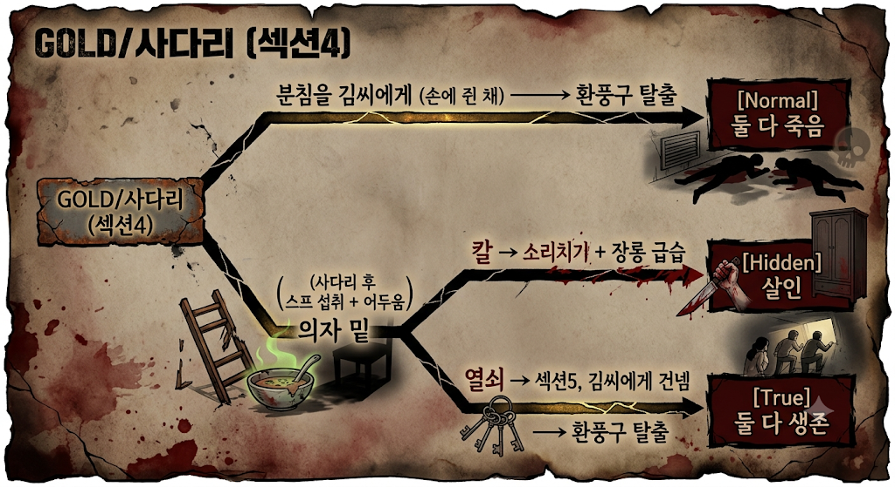


